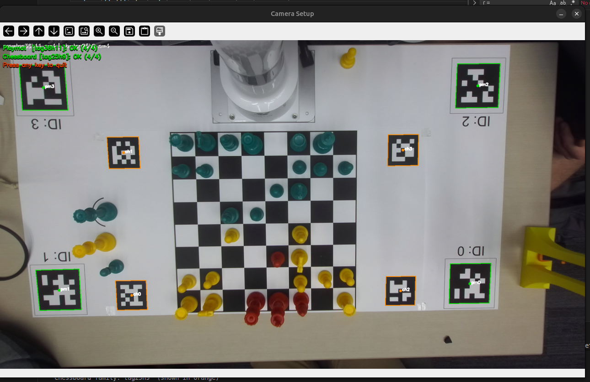
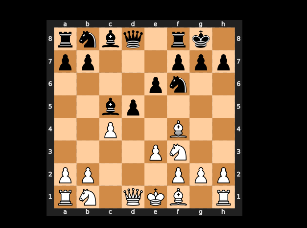

# Magnus Carlsen Robot

Physical chess with vision (ZED + AprilTags), **Stockfish** for the robot’s moves, and an **xArm** Lite 6 to move Black’s pieces. The human always plays **White**. The robot only plays **Black**. The main program watches the board, turns vision diffs into legal moves on a `python-chess` board, and drives the arm when it is Black’s turn.

### Documentation images (`docs/`)

**Raw camera frame** (setup / vision input)

**Digital board**

## Team (CSCI 5551)

| Name | Email |
|------|--------|
| John Struyk | struy013@umn.edu |
| Luke Ishag | ishag003@umn.edu |
| Jacob Mincheff | minch015@umn.edu |
| Riley Donat | donat106@umn.edu |
| Christopher Melville | melvi083@umn.edu |

## What to run

Run these from the **project root** (`Magnus-Carlsen-Robot/`).

| Command | When |
|---------|------|
| `python -m utils.camera_setup` | **Before a session** — live preview of both AprilTag families. Confirms all four corner tags (ids 0–3) on the playmat and on the board are in view. |
| `python game_loop.py` | Full game: vision -> move detection -> Stockfish + arm for Black. |
| `python -m utils.calibrate_tags` | One-shot tag preview, playmat PnP, and homing the arm (uses `ROBOT_IP_DEFAULT` in `utils/calibrate_tags.py`). |

Set `STOCKFISH_PATH` in your environment (or configure the path in `utils/stockfish_int.py`) so the engine can start.

## Repository layout

### Game loop (top-level modules)

These implement the live pipeline (`game_loop.py` imports only what it needs. The arm and persistence layers pull in `utils`).

| File | Role |
|------|------|
| `game_loop.py` | Main loop, timing, saved-game prompt, game-over handling. |
| `turn_processor.py` | Board diff -> UCI / castle / en passant, legality, apply to `chess.Board`, trigger robot on Black. |
| `robot_turn.py` | Orchestrates Stockfish + arm for Black (castles, en passant, promotion). |
| `piece_continuity.py` | Homography, piece grid, `get_board_state` / `compare_board_states`. |
| `pickup_board_piece.py` | Arm pick/place, captures, promotion swap. |
| `game_persistence.py` | `stored_game.txt` save on exit, optional resume on startup. |

### `docs/` — figures

PNG assets referenced above (`raw_image.png`, `digital_board.png`). Not loaded by the Python code.

### `utils/` — camera, calibration, engine

There is no `utils/__init__.py`. Python treats `utils` as a **namespace package**, which is enough for `python -m utils.camera_setup` and `from utils.zed_camera import …` when the working directory is the repo root.

| File | Role |
|------|------|
| `utils/zed_camera.py` | Threaded ZED left RGB and camera intrinsics. |
| `utils/calibrate_tags.py` | Playmat/chessboard tag families, PnP, `ROBOT_IP_DEFAULT`, preview helpers (used by the arm and setup scripts). |
| `utils/stockfish_int.py` | UCI engine + board SVG for the “press Enter” resume flow. |
| `utils/camera_setup.py` | **Test / setup camera** — OpenCV window with green (playmat) and orange (chessboard) tag overlays. |

## Configuration

- **Starting position:** If vision does not match the standard 8×8 pattern, set `CURRENT_FEN` in `game_loop.py` or align the physical board.
- **Capture cadence:** `CAPTURE_INTERVAL` in `game_loop.py` (seconds between frames).
- **Robot / board geometry:** `pickup_board_piece.py` and `piece_continuity.py` (and playmat tag constants in `utils/calibrate_tags.py`).
- **Saved games:** FEN in `stored_game.txt` (created when you exit `game_loop.py`).

## Dependencies

Python packages: `opencv-python`, `numpy`, `python-chess`, `pupil-apriltags`, `scipy`, `xarm-python-sdk`, `pyzed`.

System: **Stockfish** binary on `PATH` or path set in `utils/stockfish_int.py`. **ZED SDK** with Python bindings. Robot reachable on the LAN for arm moves.
